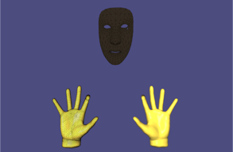

# Skeletal Animation for Three-finger Exoskeleton and Face Landmarking
This application combines our
[Skeletal Animation application](https://github.com/amartsop/SkeletalAnimationMultiThread) for the real-time
rendering of the [three-finger exoskeleton](https://github.com/amartsop/Exoskeleton) with real-time face landmarking and rendering.
For this, we have used the MediaPipe library, which empleys machine learning
algorithms for identifying 468 unique points that are scattered across the users face. The points are
generated in real-time using a camera stream and they are sent to our rendering application (LibIGL) through means of interprocess communication.

For more information on the software please see the reference document 
[reference document](https://github.com/amartsop/ExoskeletonHandover/blob/master/main.pdf), while for the full documentation please visit the [API referece](https://amartsop.github.io/SkeletalAnimationMultiThreadFace/index.html).